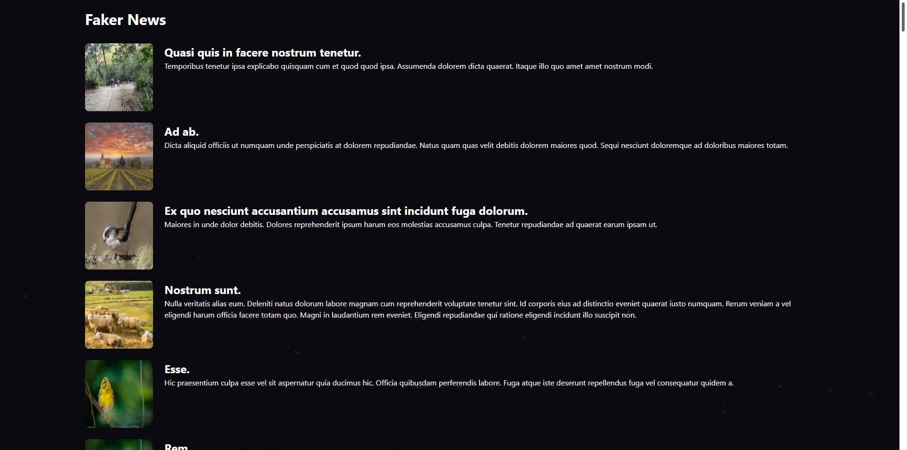

# react18-boilerplate

> 基于 React 18 搭建的一个企业级轻量项目模板，易于扩展。

## 如何开始

```
# 1. 克隆项目；
git clone https://github.com/Fujihai/react18-boilerplate.git local-project-name

# 2. 进入本地文件夹；
cd local-project-name/

# 3. 安装依赖（也可以使用 npm、pnpm）；
yarn install

# 4. 启用开发 mock 模式。
yarn start-mock
```

## 示例截图



## 文件结构

```
react18-boilerplate
├─ .commitlintrc.json
├─ .editorconfig
├─ .eslintignore
├─ .eslintrc.json
├─ .gitattributes
├─ .gitignore
├─ .husky
├─ .prettierrc.json
├─ .vscode
├─ craco.config.js
├─ jsconfig.json
├─ docs
├─ public
└─ src
    ├─ App.css
    ├─ App.jsx
    ├─ AppProviders.jsx
    ├─ AppRoutes.jsx
    ├─ GlobalStyles.jsx
    ├─ assets
    ├─ components
    ├─ constants
    ├─ features
    ├─ hooks
    ├─ index.css
    ├─ index.jsx
    ├─ lib
    ├─ mocks
    ├─ reportWebVitals.js
    ├─ setupProxy.js
    └─ setupTests.js
```

### .commitlintrc.json

Commitlint 配置文件，标准化 commit 提交格式。

### .editorconfig

编辑器文件，在不同编辑器的保持代码风格一致。

### `.eslintignore`、`.eslintrc.json`

ESLint 相关配置文件

### `.gitattributes`、`.gitignore`

Git 配置

### .husky

Husky 配置

### .prettierrc.json

Prettier 插件配置文件

### docs

项目文档

### public

存放不需要经过编译的静态资源的文件夹

### src

项目核心源码文件

#### components

通用组件

#### assets

静态资源文件，如 js、css、img 等

#### constants

Global constants，include request api url and environment variable.

全局常量，包括请求 API 前缀及环境变量等

#### features

业务模块

#### hooks

通用 hooks

#### lib

通用库插件封装，比如请求拦截器封装。

Global request with interceptors configuration.

#### mocks

mock 相关处理，前往 [msw](https://mswjs.io/docs/basics) 查看更多。
