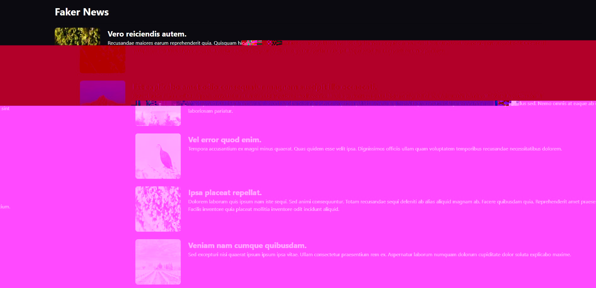

# react18-boilerplate

> A scalable enterprise boilerplate with React 18.

## Getting Started

```
# 1. Clone repository.
git clone https://github.com/Fujihai/react18-boilerplate.git
git local-project-name

# 2. Enter local-project folder.
cd local-project-name/

# 3. Install dependencies.
yarn install

# 4. Run project with development mode. Switch to mock mode, use `yarn start-mock`.
yarn start
```

## demo



## Documentations

- [file structure](docs/file-structure.md)
